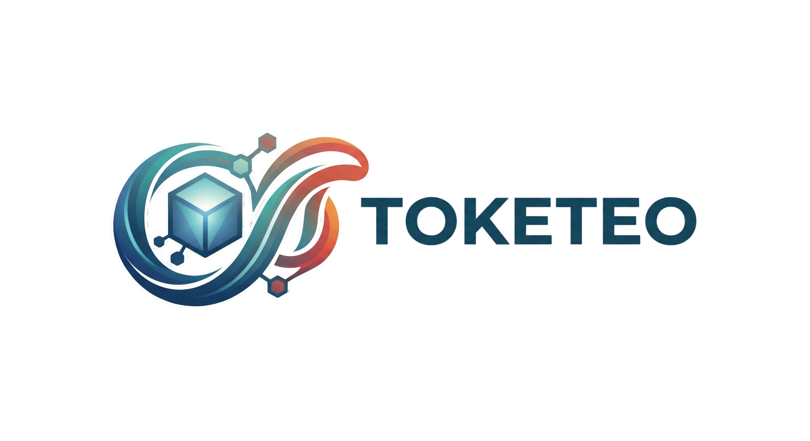

# 🔱 Toketeo — Database Administration & Architecture Studio

**Toketeo** is a high-performance, cross-platform database administration client built with **Rust + Tauri v2** and **React 19**. It unifies multi-engine management, interactive SQL AST visualization, visual ER schema design, AI-assisted querying, and an RPG-like gamification progression system — execute queries, earn XP, level up, unlock perks, and complete quests while managing your data infrastructure.

## Download windows version at : https://toketeo.crdsyntax.workers.dev/



---

## ✨ Core Features & Highlights

### 🔀 SQL Schema Flow (AST Diagram & Data Flow)
- **AST-Powered Graph Parsing**: Analyzes complex SQL queries with `sqlparser` in Rust to extract base tables, `INNER`/`LEFT`/`RIGHT`/`FULL` JOINs, aliases, and join conditions into an interactive DAG visualization powered by `@xyflow/react`.
- **Entity Record Deduplication**: Runs the query and disambiguates aliased projections (`alias__column`), populating each table node with its exact matched rows and records in both tabular and JSON views.
- **Diagram Exporting**: Export the schema flow directly as a **Mermaid (`.mmd`)** ER diagram or as a high-resolution **PNG image**.

### 📐 Visual ER Diagram & Schema Designer
- **Interactive Modeling**: Canvas for exploring and modeling tables, views, procedures, functions, and triggers.
- **Relationship & Cardinality Mapping**: Visualizes foreign keys and cardinality symbols (`1:1`, `1:N`, `N:M`).
- **Import & Export**: Save and load diagrams as JSON files or export them directly to Mermaid syntax.

### 🍃 MongoDB Document Studio
- **Full Query Support**: Native MongoDB driver with support for `$find`, `$project`, `$sort`, `$collation`, and `$hint` filters.
- **Multiple View Modes**: Seamlessly switch between **Table View**, **List View**, and **JSON View**.
- **Dual JSON Format**:
  - **Simplified JSON**: Automatically unwraps BSON types (`$oid`, `$date`, `$numberLong`, `$binary`, `$regularExpression`, etc.) into clean `{ "key": value }` structures.
  - **Raw EJSON**: Inspect raw MongoDB Extended JSON representations when exact type annotations are required.
- **Mongo Shell Syntax**: Support for executing native Mongo shell scripts.

### 💻 CodeMirror 6 SQL Workspace
- **High-Performance Editor**: Built on CodeMirror 6 with custom One Dark theming, syntax highlighting, autocompletion, and SQL formatting.
- **Interactive Transactions**: Explicit transaction banner with one-click `COMMIT` and `ROLLBACK` management.
- **Split Layout & History**: Flexible split view with resizable editor and results grid, execution duration tracking, and query history replaying.

### 🔍 Smart Data Browser & Visual Diff
- **In-Place Cell Editing**: Context-aware inputs (datetime-local pickers, boolean toggle switches, and enum dropdowns).
- **Visual Diff Review**: Non-destructive review panel showing previous vs. next values before persisting changes.
- **Batch Operations**: Execute safe batch operations (`SELECT by IDs`, `UPDATE by IDs`, `SET NULL`, `DELETE by IDs`) with SQL preview.
- **Production Guard**: Highlights production environments in red and enforces explicit commits to protect critical data.

### 🤖 Smart Assistant Hub & AI SQL Fixer
- **Multi-Provider AI**: Connect with OpenAI, Claude, Gemini, DeepSeek, Ollama (local), and OpenCode.
- **Context-Aware SQL Generation**: Injects relevant schema metadata (tables, columns, foreign keys) into the LLM context.
- **Runtime SQL Fixer**: When a query fails, the assistant analyzes the error code against the active database schema and suggests one-click verified fixes in the editor.

### 🔄 DB Compare & Cross-DB Sync
- **Schema & Data Comparison**: Diff structural objects and table rows between separate connections.
- **Sync Script Generation**: Generates migration scripts to bring target databases in sync.
- **Cross-DB Pipelines**: Automated pipeline engine for synchronizing data across heterogeneous engines (e.g. MySQL $\leftrightarrow$ PostgreSQL).

### ⏰ Automated Tasks & Dump Studio
- **Query & Backup Scheduler**: Cron-based recurring jobs for database dumps (`pg_dump`, `mysqldump`, `sqlite3`), periodic JSON reports, and CSV exports.
- **Tabular Dump & Restore**: Granular selection of tables, views, triggers, and procedures with post-dump integrity checks.

---

## 🎮 The Gamification System

Toketeo turns everyday database administration into a rewarding RPG journey. Every query, schema change, and administration task awards Experience Points (XP) calculated dynamically based on real architectural complexity:

### ⚡ Dynamic XP Calculation Engine

The engine parses and evaluates SQL queries in real-time to reward technical depth:

| Action / SQL Construct | XP Awarded | Complexity Details |
|------------------------|------------|--------------------|
| **CREATE INDEX** | **+150 XP** | Unique and composite index definitions |
| **CREATE VIEW** | **+100 XP** | Materialized / standard view creations |
| **CTEs (`WITH ...`)** | **+50 XP** | Common Table Expressions |
| **CREATE TABLE AS SELECT** | **+80 XP** | DDL + DML pipeline statements |
| **ALTER TABLE / DDL** | **+40 XP** | Schema migrations and structure alterations |
| **DROP Object** | **+30 XP** | Controlled object destructions |
| **JOIN Statements** | **+25 to +40+ XP** | Scales with multiple join nodes (25 XP for 1st, +15 XP per additional) |
| **UNION / INTERSECT / EXCEPT** | **+15 to +20 XP** | Set operation queries |
| **Window Functions (`OVER ()`)** | **+15 XP** | Analytical partitions and ranking |
| **Subqueries / Nested SELECTs** | **+10 XP** | Rewarded per additional query layer |
| **GROUP BY & HAVING** | **+10 XP** | Aggregate groupings |
| **First-Time Execution** | **1.5x Multiplier** | Discovery bonus for novel, complex query executions |
| **Inline Row Edit** | **+10 XP** | In-place modifications in the data browser |
| **Export Data** | **+25 XP** | Exporting results to CSV or JSON formats |
| **Create Connection** | **+50 XP** | Registering and connecting to a database |
| **Daily Streak** | **+25 to +200 XP** | Consecutive daily check-ins (+5 XP/day, capped at 200) |

### 📈 Hardcore Progression Curve & Ranks

The progression follows an exponential difficulty curve:
$$\text{Level} = \left\lfloor \left(\frac{\text{XP}}{10,000}\right)^{\frac{1}{2.2}} \right\rfloor + 1$$

```
Level 1–4     Data Novice
Level 5–9     Query Scrapper
Level 10–14   Schema Explorer
Level 15–19   Query Knight
Level 20–29   Database Artisan
Level 30–39   Query Architect
Level 40–49   Data Wizard
Level 50–74   DBA Overlord
Level 75–99   Grandmaster of Data
Level 100+    God of Data
```

### 🧙 Evolving Pixel-Art Wizard Companions

Your in-app companion dynamically evolves its custom pixel-art avatar based on your current level:

| Tier | Title | Unlocks At | Visual Form |
|------|-------|------------|-------------|
| **Novice** | Data Novice | Level 1 | Apprentice robe and wooden staff |
| **Wizard** | Data Wizard | Level 5 | Pointed wizard hat and enchanted orb |
| **Archmage** | Query Architect | Level 15 | Flowing mystic robes and rune staff |
| **Grandmaster** | Grandmaster of Data | Level 30 | Golden crown and ancient tome |
| **Overlord** | DBA Overlord | Level 50 | Dark shadow armor and flame scythe |
| **Deity** | God of Data | Level 75+ | Celestial halo, golden aura, and divine scepter |

### 🕵️ Story-Driven SQL Learning Adventure ("The Cheesemaker Murders")

Toketeo features an interactive detective story RPG that teaches database architecture and SQL query construction through immersive crime-solving:

- **Immersive Narrative Campaign**: Set in the rain-drenched streets of *Nullville*, you step into the shoes of a data investigator solving *"Case: The Cheesemaker Murders / Los asesinatos de la Quesera"*.
- **Atmospheric Pixel-Art Scenes & NPCs**: Travel through thematic nodes (*The Street*, *The Morgue*, *The Cheese Shop*, *The Graveyard*, *The Warehouse*, *The Throne*) interviewing suspects and forensic experts (*The Coroner*, *The Scribe*, *The Witness*, *The Ghost*, *The Butcher*, *The Boss*).
- **Interactive SQL Challenges**:
  - **Data Integrity Puzzles**: Understand the differences between non-destructive inspection (`SELECT`) and destructive alterations (`UPDATE` / `DELETE`).
  - **Live Query Solving**: Write and test actual SQL queries against case tables (`victims`, `suspects`, `evidence`, `roles`, `deliveries`) using projections, `WHERE` predicates, multi-table `JOINs`, `GROUP BY`, `HAVING`, and aggregation functions.
  - **Analytical Deductions**: Filter, join, and analyze clues to uncover culprits and deduce murder weapons.
- **Interactive Concept Glossary (`TermTip`)**: Integrated learning definitions with runnable code examples for relational concepts (`JOIN`, `FOREIGN KEY`, `PRIMARY KEY`, `GROUP BY`, `HAVING`, `PROJECTION`, `INDEX`, `NULL`).
- **Bilingual & Real Progression**: Complete story, hints, and explanations in both **English and Spanish**, awarding from **+150 to +200 XP** per puzzle and **+1,000 XP** for boss stages directly to your Toketeo account.

### 🎯 21 Quests & Achievements

Progress is tracked across 5 achievement categories:
- **Query Master**: Execute from 1 up to 10,000 SQL queries.
- **Data Surgeon**: Perform from 1 up to 1,000 inline cell edits.
- **Realm Builder**: Create from 1 up to 10 active database connections.
- **Data Courier**: Export from 1 up to 200 datasets (CSV/JSON).
- **Dedicated Scholar**: Maintain daily streaks up to 365 consecutive days.

### 🔓 Unlockable Perks & Feature Gates

Leveling up permanently unlocks advanced features across the platform:

| Perk | Required Level | Feature Unlocked |
|------|----------------|------------------|
| **Advanced Theming** | Level 1 | Custom RGB accent palettes and dynamic theme customization |
| **AI Query Assistant** | Level 1 | Conversational SQL generator and `/assistant` hub |
| **Schema Diagram** | Level 1 | Visual ER diagram designer and relationship mapping |
| **Query Scheduler** | Level 1 | Background cron jobs, automated backups, and reports |
| **Cross-DB Sync** | Level 1 | Multi-engine cross-database synchronization pipelines |
| **Data Visualizer** | Level 15 | Performance analytics, execution charts, and slow-query dashboards |

---

## 🔌 Supported Database Engines

- 🐬 **MySQL** & **MariaDB** (via `sqlx`)
- 🐘 **PostgreSQL** (via `sqlx`)
- 🍃 **MongoDB** (via `mongodb` driver)
- 🪟 **Microsoft SQL Server** (via `tiberius`)
- 🪶 **SQLite** (via `sqlx`)
- ⚡ **Redis** (via `fred`)
- 🔒 **SSH Jump Hosts** (native SSH tunnels for remote database access)

---

## 🏗️ Architecture & Technology Stack

Toketeo is engineered with a memory-safe, asynchronous Rust backend and a reactive React 19 frontend:

```
toketeo/
├── src-tauri/                       # Rust Backend (Tauri v2)
│   ├── src/
│   │   ├── application/             # Domain & business logic
│   │   │   ├── assistant/           # AI orchestrator, adapters, tool calling & SQL fixer
│   │   │   ├── compare/             # Schema & data diff engine
│   │   │   ├── sql_flow_service.rs  # SQL AST parsing & live record deduplication
│   │   │   ├── sync/                # Cross-engine data pipelines
│   │   │   ├── explorer_service.rs  # Schema introspection, dump/restore & integrity
│   │   │   └── session_service.rs   # Metadata caching & connection pools
│   │   ├── db/                      # Driver implementations (MySQL, Postgres, Mongo, MSSQL, SQLite, Redis)
│   │   ├── infrastructure/          # Scheduler engine, crypto keyring & driver factory
│   │   ├── presentation/tauri/      # Tauri IPC command handlers
│   │   ├── models/                  # Shared data models (SQL flow, diagrams, assistant, sync)
│   │   ├── ssh/                     # SSH tunneling engine
│   │   ├── lib.rs                   # Plugin registration & command router
│   │   └── main.rs                  # Native application entry point
│   └── Cargo.toml                   # Rust dependencies (Tauri 2.11, sqlx 0.8, tokio, sqlparser)
│
├── frontend/                        # Frontend (React 19 + TypeScript + Vite)
│   ├── src/
│   │   ├── components/
│   │   │   ├── query/               # QueryEditor, results grid, modals & flow/ (SQL Schema Flow)
│   │   │   ├── explorer/            # Object explorer, DDL viewer & DataTab (Table/List/JSON)
│   │   │   ├── diagram/             # Visual ER Diagram designer & Mermaid exporters
│   │   │   ├── assistant/           # AI assistant panels, wizard & SQL fixer modal
│   │   │   ├── compare/             # DB Compare & diff visualizer
│   │   │   ├── scheduler/           # Cron job manager & schedule cards
│   │   │   ├── connections/         # Connection tree & Dump/Restore manager
│   │   │   ├── gamification/        # LevelBadge, quest progress & perk tree
│   │   │   └── ui/                  # JsonResultsView, ReviewChangePanel, modals & controls
│   │   ├── store/                   # Zustand stores (app, gamification, performance, assistant)
│   │   ├── hooks/                   # useQueryEditor, useExplorer & custom hooks
│   │   ├── services/                # Tauri IPC service abstractions
│   │   └── lib/                     # mongoJsonHelper, sqlGenerator, formatCellValue & utils
│   └── package.json                 # React 19, Vite 8, Tailwind CSS v4, @xyflow/react v12, CodeMirror 6
```

---

## 🚀 Getting Started

### Prerequisites

- **[Bun](https://bun.sh/)** (JavaScript runtime & package manager)
- **[Rust](https://rustup.rs/)** (Stable toolchain $\ge 1.77$)

### Installation

```bash
# Clone the repository
git clone https://github.com/crdsyntax/toketeo.git
cd toketeo

# Install dependencies
bun install
cd frontend && bun install && cd ..
```

### Running in Development

```bash
bun run tauri:dev
```

This starts the Vite development server with hot-module replacement and launches the native Tauri desktop window.

---

## 📦 Production Builds

### Linux (.deb / .AppImage)

```bash
bun run tauri:build
```

### Windows (.msi / Portable .zip)

```bash
bun run tauri:build -- --target x86_64-pc-windows-msvc
```

Output binaries and installers are generated in `src-tauri/target/release/bundle/`. Releases are signed using the project's signing key via `scripts/publish-update.ps1`.

---

## ✒️ Author & Contributing

- **crdsyntax** — [GitHub](https://github.com/crdsyntax)

Contributions and pull requests are welcome! Please check [CONTRIBUTING.md](./CONTRIBUTING.md) for contribution guidelines, local CI check commands, and branch policies.
